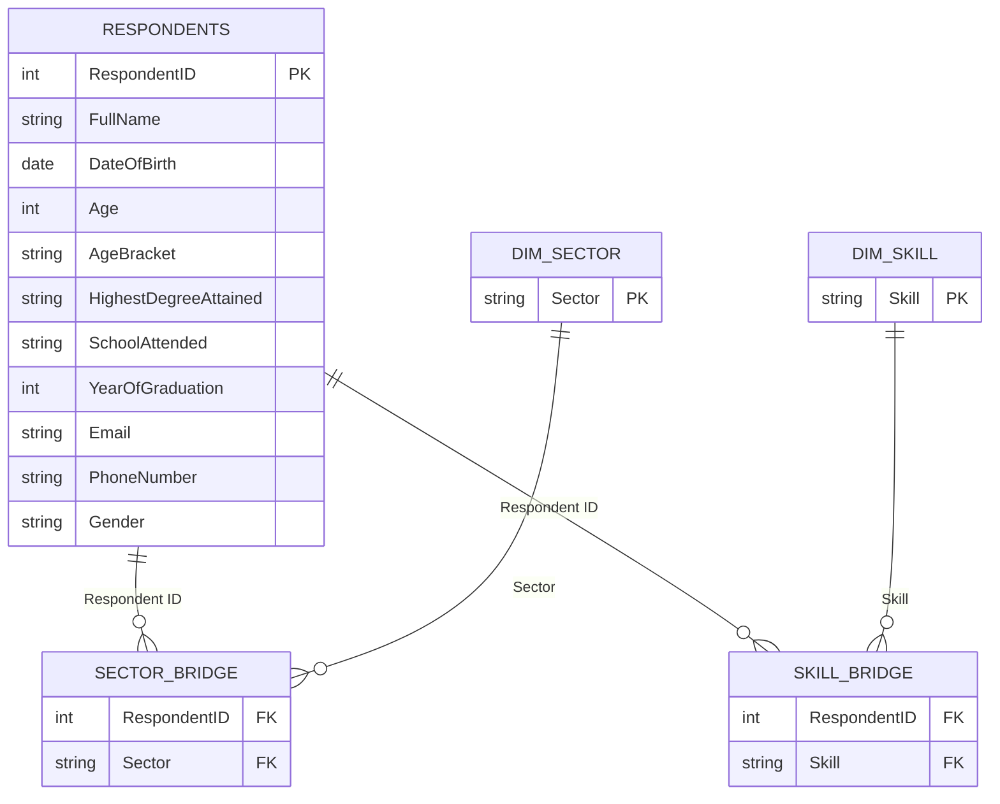

# Ekiti-State-Unemployment-Survey-Analysis

### Contents

- [Project Overview](#project-overview)
- [Data Source](#data-source)
- [Data Cleaning and Preparation](#data-cleaning-and-preparation)
- [Data Model](#data-model)
- [Key Measures](#key-measures)
- [Dashboard](#dashboard)
- [Key Insights](#key-insights)
- [Recommendations](#recommendations)
- [Tools](#tools)
- [Limitations](#limitations)

### Project Overview

An NGO working on youth and graduate employment in Ekiti State collected survey responses from unemployed individuals to understand who they are, what they studied, which sectors they want to work in, and what skills they already have. The raw data arrived as a single flat Excel export with heavy free-text entry, duplicate submissions, and several multi-select fields stored as inconsistent semicolon-delimited text.

This project turns that raw export into a clean, related data model with a working dashboard and an executive report, so the NGO can prioritize programs by actual respondent demand instead of assumption.

### Data Source

A single Excel sheet of raw survey submissions, one row per response, covering: full name, date of birth, age, age bracket, highest degree attained, school attended, year of graduation, phone number, email, gender, preferred sector(s), and skill set(s).

The raw export contained **1,006 submissions**. After cleaning, **921** were retained for analysis (see below).

### Data Cleaning and Preparation

| Step | Detail |
|---|---|
| Deduplication | Matched on Full Name + Date of Birth (more reliable than phone number, which had typo'd digits between repeat submissions). Kept the latest submission per person. Removed 51 duplicate rows. |
| Invalid row filtering | Removed rows with implausible ages (0, 5, 125), missing gender, and a future graduation-year sentinel value. |
| Text cleanup | Trimmed whitespace, fixed inconsistent casing (`Hnd` &rarr; `HND`, `Nce` &rarr; `NCE`), lowercased emails, stripped trailing delimiters. |
| Age Bracket recalibration | Replaced vague labels ("Youth", "Young Adult", "Middle Age", "Older Adult") with explicit, unambiguous bins (18-24, 25-34, 35-44, 45+) computed directly from Age. |
| Sector cleanup | 150 raw free-text values, many combined via semicolons, consolidated into 16 canonical sectors via a bridge table. |
| School Attended cleanup | 490 raw values (the same institution typed dozens of different ways) consolidated into a canonical institution list, with care taken not to merge genuinely different institutions that share generic name prefixes (for example, Federal Polytechnic Ado-Ekiti and Federal Polytechnic Ede are different schools). |
| Skill Set cleanup | 215 raw multi-select combinations split and consolidated into 106 canonical skills, with 15 non-answers (stray email addresses, pleas for consideration, "Nill"/"None") excluded rather than guessed at. |
| Sensitive fields | Email and Phone Number hidden from report view. |

Every cleaning decision that involved judgment (merging similarly-named institutions, categorizing free-text sector answers) was reviewed against the raw data before being applied, rather than applied automatically on a similarity-score threshold alone.

### Data Model

The model is a star schema with two many-to-many bridge tables to handle the multi-select survey fields.

Respondents can select more than one sector and more than one skill, so a flat one-row-per-respondent table cannot represent that correctly without either losing information or double-counting. The bridge-table pattern (respondent-to-sector and respondent-to-skill, each with its own dimension table) lets both fields be filtered and counted accurately without inflating the respondent count.

Relationship notes:
- `Sector Bridge` &harr; `Respondents` and `Skill Bridge` &harr; `Respondents` are both bidirectional, so a filter on either dimension correctly filters the respondent-level measures.
- `Dim Sector` &rarr; `Sector Bridge` and `Dim Skill` &rarr; `Skill Bridge` are single-direction (standard dimension-to-fact filtering).

A dedicated, hidden `_Measures` table holds all DAX measures, organized into display folders, rather than scattering them across the data tables.

### Key Measures

- **Core KPIs** — Total Respondents, Average/Median Age, Sector Selection stats
- **Demographics** — gender and age-bracket percentages
- **Education** — qualification percentages, most common degree
- **Sector Insights** — sector-level respondent counts and percentages, top sector
- **Graduation & Time** — graduation year range, average, and recency stats
  
Two measures generate dynamic narrative text rather than a single number, so a card or text box on the dashboard reads as a sentence and updates automatically as filters change:
- **Education Summary** — reports the smallest set of qualifications that cover at least 75% of respondents, in plain English.
- **Graduation Year Summary** — reports the peak graduation year and its share of respondents.

### Dashboard

Two report pages.

#### Overview Page
KPI cards (total respondents, gender split, average age, most common degree), a qualification distribution donut, an age group distribution donut, a top-reported-skills bar chart, and a graduation-year trend line paired with the dynamic Education Summary and Graduation Year Summary text.

#### Sector Analysis Page
Sector distribution by respondent count, and the same distribution broken down by gender, age bracket, and qualification, to surface which sectors skew toward which demographic groups.

### Key Insights

1. Respondents skew female (65%) and are concentrated in the 25-44 age range (92%), indicating a working-age population rather than new school leavers.
2. Health (33%) and Education (30%) are the two largest sectors of interest, well ahead of Agriculture (23%) and Tech (11%).
3. Sector interest splits sharply by gender: Health is 83% female, while Tech and Agriculture lean male. Program design should account for this rather than assume even participation.
4. Three institutions (Ekiti State University, Federal Polytechnic Ado-Ekiti, and College of Health Sciences and Technology Ijero-Ekiti) account for over a third of all respondents, making them natural anchors for outreach or partnership efforts.
5. Health Care is the most reported personal skill (37%), ahead of Project Management (21%), and tracks closely with Health being the top sector of interest, unlike Tech, where stated interest outpaces reported technical skills.

## Recommendations

Condensed from the [executive report](reports/Ekiti_Unemployment_Survey_Executive_Report.docx):

1. **Prioritize Health and Education sector programming.** Together they represent the stated interest of roughly 6 in 10 respondents; design them knowing the audience will be predominantly female.
2. **Treat Tech-sector interest as a training opportunity, not a placement-ready pool.** Stated interest (11%) outpaces the number of respondents reporting concrete tech skills, so foundational training likely needs to precede placement.
3. **Anchor outreach and partnerships at the top institutions.** Ekiti State University, Federal Polytechnic Ado-Ekiti, College of Health Sciences and Technology Ijero-Ekiti, College of Education Ikere-Ekiti, and Kwara State College of Health Technology Offa together reach roughly 40% of this population.
4. **Design gender-focused programming around the actual sector splits**, not an assumption of even participation. A generic program is unlikely to reach male respondents in Health or female respondents in Tech without deliberate design.
5. **Fix data collection at the source.** The free-text problems that required most of the cleanup here (schools, sectors, and skills all typed inconsistently) will recur in future survey rounds unless the intake form uses fixed dropdown choices instead of open text fields.

### Tools

- **Power BI Desktop** — data modeling, DAX, report visuals
- **Power Query (M)** — data cleaning, bridge table construction

### Limitations

- 21 duplicate email addresses remain among distinct respondents; this was left as-is since it likely reflects shared household or cybercafe emails rather than duplicate people, and collapsing it further risked merging different respondents.
- Two respondents remain in an "Unclassified" age bracket: one has a blank Age field, the other reported an age of 16, below the survey's 18+ bins.
- A small number of respondents reported a graduation year in the future (as late as 2027), left in the data as a known data-entry quirk rather than removed, since it did not materially affect any of the reported statistics.
- Roughly 100+ niche skills and 200+ small institutions were left as their own distinct, unmerged categories rather than folded into broader buckets, to avoid losing signal by over-consolidating.
